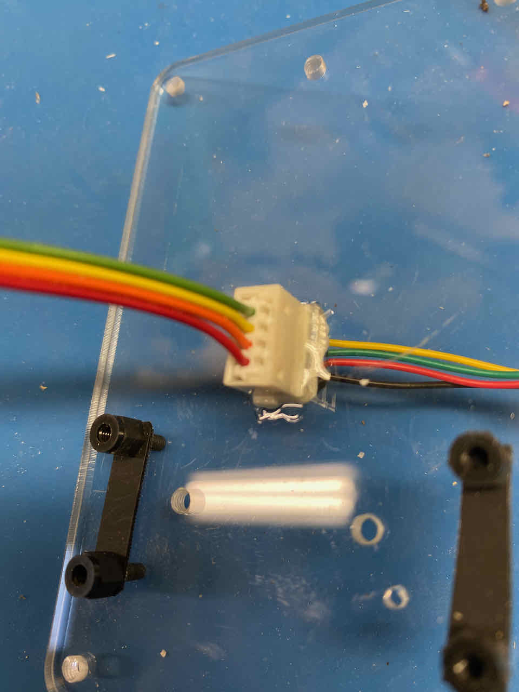
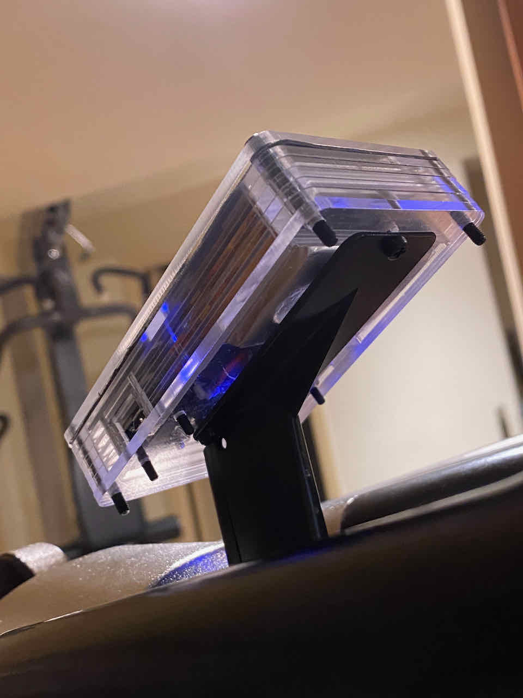

## Build with layered acrylic case
This build is done with seven layers of 3 mm clear acrylic. Design/drawing was done in Fusion 360 with cleanup of the DXF files in VersaCAD. The parts were cut by [SendCutSend](sendcutsend.com). What's below is focused on assembly in the case. It may be helpful to read the more general [HOWTO](HOWTO.md) first.

### Parts

- Parts for the case
  - Seven-layers of laser cut 3 mm acrylic, as shown below, per the DXF files provided.
  - A mask layer, cut from thin plastic, heavy paper, or other suitable material.
  - Four 3 mm x 22 mm (or longer) screws for the corners. These can be nylon, steel, or anodized aluminum. Nylon works well with threaded acrylic and it's easy to cut.
  - Three 3 mm x 5 mm screws to hold the computer to the mounting plate on the bike. 
  - Four 2.5 mm x 6 mm threaded nylon standoffs
  - Four 2.5 mm x 4 mm nylon screws to hold the Feather to the standoffs
- Wiring and connectors
  - Suitable wire, such as rainbow ribbon cable 
  - Heat shrink tubing
  - A 4-pin, 2 mm pitch IDC connector (like the one on the cable in the bike) - LINK
  - A 4-pin, 2 mm pitch inline connector - LINK
  - (Optional) A new cable for the bike, if you'de like to easily swap between KBikeBLE and the old Keiser computer.
- Electronics
  - Adafruit Feather nrf52840 Express
  - 128 x 64 OLED display. This example uses THIS ONE (LINK)
  - 1800 mAHr Li-Po battery

In the photo below, the seven acrylic pieces plus a mask for the display (cut from an old plastic DVD case) are shown in order. 

From bottom-right, the layers are
  - The bottom plate. It has threaded holes at the four corners, for the three screws that hold the computer to the bike, and for the four standoffs that hold the Feather. It also has a hole that aligns with the Feather reset button, and an opening for the 4-pin connector that mates with the connector on the cable in the bike.
  - Layers 1 and 2. These are identical. The tab toward the left helps to define the mounting space for the battery. The opening at the lower right is for the USB cable.
  - Layer 3. The same as Layers 1 and 2, only with a shorter tab separating the battery and Feather compartments.
  - Layer 4. The same as Layer 3, except now we're above the USB cable opening. Note the holes on either side of the USB opening in Layers 1-4. Stiff wire or bits cut from a heavy paperclip go through these holes, holding the four layers together around the opening.
  - Layer 5 (top row, right). It defines the placement of the display, which sits on top of the battery.
  - Mask. Hides the components while leaving a window for the display. You can use whatever you have on hand, print a graphic on paper or acetate, etc.
  - Cover.

### Assembly

1. **Clean up the screw holes and USB reinforcement holes.

    The laser cutting people specified accuracy as +/- about 0.2 mm. All holes were under-sized accordingly in the drawings, so you have to check the finished holes and drill them to final size as needed. A 75% thread is recommended, but the 50% thread bits that come with many tap and drill sets will work. 

    Drill the holes on either side of the USB opening as needed to match the wire you have on hand.

1. Tap holes in the bottom plate. 

    The bottom plate has four holes for 2.5 mm screws for the standoffs that hold the Feather, four holes for 3 mm screws at the corners to hold the stack together, and three holes for 3 mm screws to hold the finished computer to the mount on the Keiser bike. You could use nuts instead of tapping the holes for all except the mounting to the bike. It should be possible to avoid tapping those holes by making room for nuts on the inside of the case and gluing the nuts in place.

1. At this point, you can peel off the protective film or paper from all the acrylic pieces. From now on, be cautious of scratches.

1. Insert the standoffs on the bottom plate.

    Identify the top surface of the bottom plate. The plate is very close to symmetrical - a hole at each of the four corners, and four holes for the standoffs that hold the Feather - except for the extra hole near one of the standoffs.  When the Feather is placed *component side down*, the extra hole will line up with the reset button. Lay the bottom plate on your work surface so that the four holes for the standoffs are at the bottom and the reset button hole is toward the right. Now insert the 6 mm standoffs from the exposed side. 

1. Mount the connector for the bike cable.

    In this build, we'll connect to the Keiser cable that's part of the bike using the existing 4-pin, 2 mm spacing connector. The cutout on the bottom plate accomodates what TE Connectivity calls an inline connector. Check the fit of the TE inline connector in the rectangular opening near the center of the bottom plate. It's inserted with the shorter side down, so that it protrudes just a mm or so through the other side of the bottom plate. 
    
    Note the orientation: looking into the connector from the top, the pins and the tiny dovetails that guide the mating connector are toward the right. You can mount it either way, but this is how it's oriented in the rest of these instructions. 
    
    Insert fully, and use a bit of quick set epoxy or other suitable adhesive to hold it in place. I suggest avoiding solvents that might distort the connector body.

    The photo below shows the plate with standoffs and inline connector in place. (A note on the picture below: I ordered 5 mm standoffs instead of 6 mm, which isn't enough to keep the battery and programmer connectors from interfering, so I cut some 1 mm plastic from an old DVD box to raise them a bit.)

    

1. Insert wires into the 4-pin, 2 mm pitch IDC connector.

    Rainbow ribbon cable is recommended to help keep things neat and for the color coding. It's very unlikely that your ribbon cable with have yellow, green, red, and black in that order. Just pick a section that provides reasonable, easily differentiated, colors, as in the photos below. About 4" / 10 cm is plenty.
    
    Insert the insulated wires between the blades of the IDC connector and into the little keyhole slots. Of course, TE makes a tool for this purpose, which you're unlikely to have. I was successful with a small flat blade screwdriver, which I verified in advance would fit between the insulation displacement blades. Once pressed all the way in, the conductors should be well attached.

1. Map the wire colors.

   Plug the completed assembly into the top of the connector, and the Keiser cable into the back. Note the conductor colors from the top (toward where the battery will sit) to the bottom (toward the feather).  

    

    Make a chart like the one below, substituting your conductor colors in the last column:

    Pin | Function | Feather connection | Cable color* | Internal color (*Your colors here*)
    ----| -------- | ------------------ | ----------- | --------------
    1 (top) | Common | GND (shared with the OLED display) | Yellow | Green 
    2 | Crank switch | A1 via 2.2K resistor | Green | Yellow
    3 | Resistance sense | A2 | Red | Orange
    4 (bottom) | Resistance sensor excitation | A3 | Black | Red
    
    \*NOTE: The cable colors are from a later model M3. Check that your are the same. There's more guidance in [HOWTO](HOWTO.md).

1. Check for proper connections.

    With the Keiser cable plugged into the bike, measure as follows with an Ohm meter. Note that pin numbers are from column 1 of the chart above.

    From pin | To pin | What
    ---- | -- | ----
    1 | 2 | Crank switch: An open circuit most of the time, and zero ohms (switch closure) for a small portion of each pedal rotation
    1 | 4 | Sense pot top to bottom: About 10K ohms
    1 | 3 | Sense pot wiper to common: Between 0 and 10k ohms - increases as you rotate the magnet assembly
    4 | 3 | Sense pot wiper to top: Between 0 and 10K ohms - decreases as you rotate the magnet assembly

    These should be stable as you wiggle the wires. Being sure that you know which *internal* wire color is which, you can now disconnect from the Keiser cable.

1. Optional: Remove the NeoPixel from the Feather

   The NeoPixel display (next to the black plastic programming connector) uses 0.5 mA of idle current when off. When the user walks away from the bike and allows the computer to idle, the whole rest of the computer - Feather plus display - uses about 1 mA. So removing the NeoPixel will extend battery life a lot. A suitably small side cutter, applied across the diagonal, can be effective to pop it off or to chip away at it. Of course, you have to be very careful about adjacent components, and there's no guarantee that you won't ruin the Feather.

1. Wire the display.

   I2C busses require pullup resistors to Vcc on the clock and data lines. Neither the display used in the prototype, nor the Feather, provide them. This is common, since recommended pullups depend upon the number and nature of the devices on the bus. The first prototype used 10K and worked fine. Here, we're using the more commonly recommended 4.7K. 

   Attach wires and pullup resistors (if needed) to the display. In the example below, the pullups are attached at the pads on the boards. Of course, other arrangements are possible. In the example, the Vcc wire is soldered to the underside of the board, held in place by the resistor leads being wrapped over it. This makes the board a bit thicker at that spot, which has to be accounted for when tacking the display in place.

    

1. Mount components (temporarily at least)

    The Feather is mounted component-side down, with the USB port facing to the right. This should result in the reset button lining up with the hole in the bottom plate.

    The battery is mounted in the top half of the case, with the wire to the right and oriented down toward the Feather, and held in place with your choice of sticky substance. The first two layers of the case define the battery compartment. In the photo below, the battery is held by *removable* glue dots. Anything permanent is discouraged, especially at this stage.

    

    Add the additional acrylic layers - all but the mask and cover, and mount the display by sticking it to the battery. An option is to leave the display loose for now or use something to tack it in place temporarily, then adhere it to the back of the mask later on.

    

1. Trim and solder wires to the Feather.

    Route the conductors neatly to their respective pins. The wires can go over or under the board. Just be sure if going under that they don't get in the way of the Reset button. Trim to length, strip, and tin, being sure to avoid tension anywhere.

    As needed, you can unmount the Feather and display for soldering. You want good access to the side where each tinned conductor pokes through, and you don't want debris on your new case.

    Remember to include the 2.2K resistor in series with the crank switch conductor. Use heat shrink tubing if there's any possibility of anything touching where it shouldn't.

    For the shared ground connection, you can join both to a short length of solid wire, then solder that to the ground on the Feather.

    In the photo below, you can see the 2.2K resistor peeking out from the heat shrink on the yellow conductor. You can also see where I overheated the green (ground) conductor on the display and placed some heat shrink on the yellow wire to ensure the integrity of that conductor.

    

1. Configure, upload code, and test.

    Follow the instructions in the HOWTO to configure the code. It's a matter of choosing some options (or keeping the defaults), and, importantly, **being sure that pin selections in bike_interface.h match your wiring**. The [HOWTO](HOWTO.md) also has more detail on what to expect the first time the code is run.

    Connect to USB and upload the code to the Feather. Once uploaded and running, you should see the scrolling KBikeBLE startup log, then the display showing zero RPM, Gear 1 (probably) and zero Power.

    Disconnect from USB. You can put the mask and top cover on at this point, or you can keep the case open for now. Either way, it's recommended that you install screws in at least two corners of the case to keep the layers together. 

    Now connect to the bike, either with a spare cable, or by removing the Keiser computer and connecting the new one in its place. 

    Reach in and carefully plug the battery into the LiPoly connector. If there's any charge on the battery (typically, there is) you should see the startup log again, then the display.

    Moving the gearshift lever should cause the Gear display to change. **It's unlikey to be correct, or even close, since the computer's not yet calibrated to the bike.**

    Turning the pedals should result in a cadence (RPM) showing, and the power being more than zero. Congratulations!

1. Completing the case.

   If you haven't done so already, place the additional layers of the case. Layers 1 through four are tied together with stiff wire on either side of the USB opening. Insert the wire, then trim to length and push it in all the way.

   

   Then add layer 5, which helps to locate the display, then the mask layer the top cover, and secure with screws at the corner.

1. Mounting.

    On the bike, the black plastic piece that covers the top of the cast metal computer mount. You may need to squeeze the little tabs to release it. They break easily, but also aren't essential to keeping the cover in place, as it ends up being trapped behind the mounted computer.

    Line the three holes on the mount up with the holes on the bottom plate. 
    
    Between the rubber strain relief that protrudes from the bike frame and the connector on the back of the computer, there is far more wire than you need.  Carefully "fold" the wire back on itself, approximately in thirds. It will fit. 
    
    *Alternative:* If desired, you can shorten the cable between the strain relief and the computer, either by cutting and splicing, or by cutting and installing a new IDC connector. 

    

    Replace the black plastic cover, and secure the computer to the bike with three M3 screws.

    

You're finished with your build and install.

### Calibration

You're almost ready to go. Now see **Calibrating to your bike** in the [HOWTO](HOWTO.md). In brief, it's

1. Connect to the bike using the Arduino serial monitor (USB) or Adafruit Bluefruit Connect app.
1. Have your Keiser cal tool on hand. Type *calibrate* and press return or send. Confirm with *y* and follow the prompts.
1. Enter *activate* and confirm with *y* to have the bike use the new parameters.
1. Once satisfied, enter *write* and confirm with *y* to save the parameters in nonvolatile memory.
