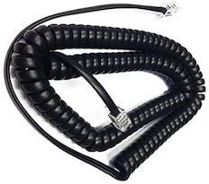

# How to build, install, and operate
## Parts needed
1. [Adafruit Feather nRF52840 Express](https://www.adafruit.com/product/4062)

    
1. A generic 128x64 pixel, 1.3" diagonal monochrome OLED display. These displays most commonly incorporate SH1106, SD1306, or similar display driver chips. Be sure that it's supported by the [U8G2 library](https://github.com/olikraus/u8g2). To use the KBikeBLE code essentially as-is, choose one that comes configured for an I2C interface. 

    
    
    The picture shows the display as it will be oriented in use. 
1. Pullup resistors for the I2C clock and data lines. Many (most?) of the generic displays will require you to add pullup resistors - something in the 10K-20K range - from the SCL and SDA pins to Vcc. According to your skills and how you plan to mount things, you can do that right on the back of the display board or in the wiring from the Feather to the display. 
1. A suitable Lithium-Polymer battery, if you want the computer to work untethered. A little 350 mAHr battery will power the device for a week or so. An 1800 mAHr battery will keep it going for a couple of months.
1. A cable to connect to the bike, via the RJ9 connector on the resistance magnet assembly (right behind the crank shaft on the left side). RJ9 is the standard for handsets on landline phones, so these are easy to get, and it's not hard to tuck under the plastic cover on the bike. Because these are handset cables, you can get coiled versions similar to the one that's in the stock bike. 
   Some choices are
    - An RJ9 cable, with the connector cut off of one end, conductors stripped, and connected to the Feather by your preferred means. These cables are made to be mechanically terminated with insulation displacement connectors, so conductors are sometimes hard to strip cleanly.

      
   - A replacement Keiser cable. [They're available](https://www.sportsmith.com/cord-computer-to-pickup/product/10341?serial=1187), they include nice strain releifs for where they pass through the tubing in the bike along with a coiled section to accommodate the handlebar adjustment, and they have conductors that should be easy to strip. The conductor colors are the same as those on a standard RJ9 cable.

     
   - An intact RJ9 cable, and an RJ9 receptacle to provide easily soldered wires for connection to the Feather.

      
   - Use the existing cable in the bike. Note that presently it may be helpful to retain the ability to compare Keiser computer readings with KBikeBLE readings, so destruction of the Keiser cable or making it hard to switch between the two isn't recommended.
1. Transient protection for the crank (pedal) rotation input to the Feather. While this may be unnecessary since the sensor assembly on the bike has a diode for the same purpose, and the GPIO pins have some protection as well, the prototype used a 2.2K ohm resistor between the crank switch and the digital input to the Feather.
1. Some sort of case. The prototype used a nice paper box with a piece of an old CD case as a window in the lid, and pieces of foam to take up unused space inside. Remember that the OLED display is configured for *portrait* (vertical) orientation.
1. A Keiser calibration tool. See the section below on calibration for alternatives.

    


  ## Connecting the parts

  Wire things as shown below. You can solder the header pins to the Feather and use a prototyping board or jumpers. Considering the modest number of connections, you can start with micro-clip jumper wires to be sure that you have everything right. If you're super-confident in what goes where, and already know how the components will be mounted in whatever case you choose, you can even solder directly. 
  
  Assuming you're using an I2C display...

  Part | Pin/conductor | Where | Notes
  ---- | ------------- | ----- | -----
  OLED display | Vcc | 3V
  || SCL | SCL
  || SDA | SDA
  || Gnd | Gnd | Ground is the only pin that has to be connected to two places: the OLED display and the RJ9 cable to the bike.
  Battery || JST connector | Be sure that the polarity is correct!
  RJ9 (bike) | Green* | Pin 9** | Crank (pedal rotation) switch***
  || Black* | Pin 10** | Resistance sensor excitation. It's connected to a GPIO pin so that the software can de-energize the sensor on the bike to save power.
  || Red* | Pin A1** | Resistance magnet position
  || Yellow* | Gnd | Resistance sensor / crank switch common

  \* Colors refer to the standard RJ9 conductors on most cables
  
  \** The resistance magnet position can use any analog input (A0-A5) and the sensor excitation and crank switch can use any GPIO (5-13 or A0-A5). If changing any of these, edit bike_interface.h accordingly

  \*** Include a 2.2K Ohm resistor between the green wire and the pin on the Feather.

  Note: An option for the display is to use the [Adafruit FeatherWing display](https://www.adafruit.com/product/4650). In that case, all you'll need to connect is the four RJ9 conductors and the series resistor. If you use the FeatherWing and install all of the header pins, Button A will be on Feather Pin 9, which per the chart below is assigned to the crank switch. You can (a) leave that header pin off of the FeatherWing, (b) use a different pin for the crank switch (green wire) and edit bike_interface.h accordinlgy, or (c) don't worry about it, as it won't hurt anything, and the button could be handy for testing without plugging into the bike.

## Installing the software
* Install the Arduino IDE if you haven't already, and follow Adafruit's instructions for installing the core for the Feather nRF52840 Express. 
* Install the required libraries via the Arduino Library Manager:
  * Adafruit Bluefruit
  * U8G2 display
* You'll probably want to run some of the examples to ensure that the Arduino installation is working.

### Configure the U8G2 library for your display.
* Choose an example from those that come with the U8G2 library, such as full_buffer/GraphicsTest or full_buffer/HelloWorld.  
* Near the top, look for a "constructor" line that matches your display. You'll specify what display you have by un-commenting the appropriate line. These are organized by driver chip (SD1306, SH1106, etc.) and interface. Taking apart an example...
    ```C
    U8G2_SH1106_128X64_NONAME_F_HW_I2C display(U8G2_R1, /* reset=*/U8X8_PIN_NONE);
    ```
  All of the constructor lines begin with `U8G2_`

    ... followed by the driver chip, e.g., `_SH1106`

    ... then the dimensions in pixels, e.g., `_128x64`

    ... and the vendor, in this case `_NONAME` for a generic display

    ... `_F` for full buffer operation which is required for KBikeBLE

    ... and finally `_HW_I2C` which is correct for an I2C interface display connected to the SCL and SDA pins on the Feather.

  The name, `display` in this example, is the name used to refer to the display elsewhere in the code. Many of the U8G2 examples use `u8g2` here. Later, when you copy the constructor line to globals.h in the KBikeBLE code, you'll use `display`.
  
  Finally, notice the `U8G2_R1` in the example above. The `R1` specifies portrait (128 pixels vertical, 64 horizontal) orientation - the orientation shown in the photo above. When experimenting with the U8G2 examples, you can simply un-comment a line that seems right and leave the default `R0`. But later, in globals.h, you need to use `R1`.

* Run the example. If it works - great! If not, look again for an another appropriate line, or check online. Often, reviews from other buyers will mention what worked for them with U8G2. More than one may work, but the display might look better with certain choices, or the effect of a call to setContrast() (see below) may be different. 
* Copy the correct constructor to globals.h in the indicated spot, being sure to leave the name as `display` and to keep the `U8G2_R1`. If you've chosen an I2C interface display, only the driver and vendor will change.

### Choosing options

Look over options.h. The file includes a number of options, with some guidance for each: 
* Display contrast (brightness). 
* Power-saving timeouts, and whether power savings between cycling sessions is by full power-down or just idling all tasks.
* Filtering the keep the resistance display and power readings from flipping around too much (note: if electrical connections are secure, you shouldn't need much filtering).
* Whether you want to default to showing the "gear" like the Keiser computer, or the resistance in %. 
* Bluetooth power. 
* Whether you want to connect to KBikeBLE's command line interface via the USB (Serial) port and/or BluetoothLE (using Adafruit's app). 
* Whether you have a battery connected, and want the Bluetooth battery service to be available

Pay attention to the settings at the very bottom of options.h. The software makes use of some functions not included in the Adafruit core for the Feather, as of version 0.24. You must leave the #defines commented out or un-commented, according to whether the indicated functions are included in the release that you're using.

## Download and first run

Before you use KBikeBLE for the first time, you may want to install the Adafruit Bluefruit Connect app on your phone, tablet or computer. You can use it to test BLE connections, and in the calibration steps below you can use its UART function instead of the Arduino serial monitor. Nordic's nRF Connect works well for testing BLE but doesn't provide the same UART functions. Now use the Arduino IDE to download the KBikeBLE to the Feather.

At reset, KBikeBLE will briefly show a little startup log. When run for the first time, it should indicate that it's written default calibration values ("Factor" and "Offset") to flash memory. It will also show a current ADC (resistance sense) reading, indicate that it's run an ADC calibration, and show a second reading. On subsequent resets, it should show that's it's *read* calibration from flash, and if you haven't moved the bike from a very cool spot to a very hot spot the two ADC readings will probably be almost the same.

After a short delay, you should see the normal cadence/resistance (or gear)/power display: 


When first connected to a new bike, the resistance or gear display will almost certainly be wrong. But you should be able to pedal the bike an see the cadence. The blue Bluetooth LED will be flashing (rapidly for 30 seconds, then more slowly) and you should be able to connect.

Open the Adafruit Bluefruit Connect app on your phone, tablet, or laptop. If the blue LED has already gone away, reset the feather.

KBikeBLE should show up in the list of nearby devices. Hit Connect. The app should connect to KBikeBLE. The blue LED should go from flashing to on, and the app should show the current battery charge (if you defined HAVE_BATTERY 1 and BLEBAS 1 in options.h) along with a list of services ("modules"). If you enabled BLEUart in options.h, one of the listed modules will be UART. Choose UART. Check that the app is set to include an end-of-line.  Then type "batt" (without the quotes) and hit Send. Or type "help" then hit Send for a list of commands. 

You can do the same things through the Serial Monitor in the Arduino IDE, under Tools, as long as you included USE_SERIAL 1 in options.h and the USB cable remains connected.

## Calibrating to your bike

The gearshift lever, through a cable, moves the magnetic brake so that more or less of the flywheel is under the influence of the magnets. Behind the cone-shaped magnet assembly, there's a position sensing potentiometer that's linked the the magnet assembly through gear teeth that mesh when the magnet assembly is placed on the bike. The rotation of both parts during assembly can vary. Calibration basically involves correcting for the variation.

As with the Keiser computer, the present calibration procedure requires Keiser's red calibration tool.  The tool fits over the flywheel and provides  "pockets" on both sides of the flywheel to receive the magnets. Holding the magnets against the tool provides the needed index position.

With the tool in hand, proceed as follows:

1. Be sure that KBikeBLE is awake. Turn the pedals so that the display comes on and the blue LED is flashing.
1. Connect to the bike either by ensuring that the USB port is connected and opening the Serial Monitor in the Arduino IDE, or by connecting through the Adafruit Bluefruit Connect app (iPhone/iPad, Android, or Mac) and choosing UART. If you've left USE_SERIAL and BLEUART defined in options.h, either will work.
1. Type *calibrate* and tap Send (phone or tablet) or Return.  (Note: all commands are case-insensitive.)
1. KBikeBLE will ask you to confirm that you want to calibrate. Type Y and Send or Return. From here, you'll get further prompts and countdowns, but no further typing is required, so your hands are free to hold the calibration tool and move the magnet assembly.  Be sure to abide by the instruction to leave the gearshift lever at the bottom and move the magnet assembly by hand. Any tension in the cable can affect the measurement. When prompted, gently holding the magnets in the pockets of the tool is all you need to do.
1. KBikeBLE will walk you through the procedure. 
    * At two steps - placing the tool on the flywheel and moving it up to the magnet assembly, and moving the magnets against the pockets in the tool - it will prompt and then show a 5-second count as you follow the instructions.  
    * KBikeBLE will show you the ten magnet position mesurements it has taken. These should be pretty consistent. Check that they vary by no more than a few single digits. Check that the first few and last few are similar to the middle measurements, indicating that you got the magnets settled into the pockets before measurements begain and held them there throughout. If in doubt, you can always repeat the procedure.
1. KBikeBLE will tell you what offset and factor it has determined. The offset is actually what has been determined, since (as far as we know) the factor shouldn't change. *These values are not yet active.*
1. Type *activate* and hit Send or Return. This makes the newly determined calibration active. 
1. Be sure to remove the tool, and move the gearshift lever up and down. You should see the gear number (1 to 24) or the % resistance change accordingly.
    * NOTE: Moving the lever beyond 100% (up to where the mechanical brake touches the flywheel) will switch between the gear and % resistance displays.
    * You'll probably find that setting the gearshift lever in a vertical position gives a resistance reading of about 40% and a gear number of 13 or 14. This might vary, but if the cable was adjusted to allow the magnet assembly to be as far away from the flywheel as it can go at the bottom, and the mechanical brake in firm contact at the top, a vertical lever will be at about 40% or around the border between gears 13 and 14. 
    * At the bottom (minimum), the gear number should be 1 and the resistance at least in the neighborhood of 0 (depends upon cable adjustment). Approaching the top, the gear will reach 24 and the resistance will reach 100. Beyond the point corresponding to a resistance of 100%, the the display will switch between gear number and % resistance. 
1. KBikeBLE is now using the calibration, but it hasn't been saved. If you'd reset the Feather now, it would go back to the defaults that were saved to flash memory.  Type *write* and Send or Return.  KBikeBLE will ask for confirmation. Use y to confirm, and the calibration will be saved.  The next time you reset the Feather, the startup log will show the values being read from flash.

### Alternative calibration against the Keiser computer

If you don't have the red Keiser calibration tool but do have the original Keiser computer and are confident that it was properly calibrated to your bike, you can proceed as follows:

1. Disconnect the KBikeBLE cable from the bike and plug in the Keiser computer in its place.
1. Turn the crank to wake up the Keiser computer. Wait for it to complete its startup and to show the gear indicator.
1. Adjust the gearshift lever so that the gear is right at the edge between gear 13 and gear 14. Flickering between the two, about equal time for each, is perfect. The Keiser computers shut down quickly when the crank isn't turning, so you may need to turn it occasionally. 
1. Without moving the gearshift lever or disturbing the magnet assembly, remove the Keiser cable and plug in the KBikeBLE cable.
1. Follow the calibration procedure above, but when prompted to place the tool and move the magnet assembly, just leave the bike untouched.
1. Use *activate* and *write* as described above to use the new settings and write them to flash memory.

## Final notes

### Gear vs. resistance display
The gear display replicated Keiser's gear numbers. These are not evenly spaced, and there's a big difference between the resistances at the "bottom" and "top" of each, but perhaps you participate in spin classes that refer to them.

The % resistance display is an approximately linear indication of the rotation of the magnet assembly, i.e., of the proportion of the magnets that is interacting with the flywheel. While there's a big difference between the "bottom" and "top" of a gear, the resistance at a given two-digit resistance is pretty repeatable.

To switch what is indicated, move the gearshift lever to the very top for about a second (The display needs to be on, but you do not need to be pedaling!). To switch back, move the gearshift to a lower position for a couple of seconds, then back to the top again.

If you chose POWERSAVE = 1 in options.h, KBikeBLE will power down between sessions and when pedal movement causes it to restart the display will go back to the default.  Otherwise, the display will remain in its current mode until you again move the lever to the top.

If you want to change the default at reset, you can do so in options.h.

### Stability and filtering of resistance measurements
The resistance measurements are pretty sensitive (a few digits translates to a 1% change) and the nRF52840 analog to digital converter has some variability from measurement to measurement. Accordingly, KBikeBLE provides some ability to filter measurements to provide a steadier display. 

An important note at the outset: Measurements should be *fairly* consistent. Unfiltered, % resistance might flicker by one digit, or maybe two. Using a release of the Adafruit nRF52 core beyond version 0.24 should provide cleaner readings because it provides an advantageous ADC setting. If you are using a version beyond 0.24, including the current github master, then you then want to uncomment #define SAADC_TACQ in options.h to take advantage of it. 

If the resistance display jumps around a lot, check that your wiring is secure. Check in particular whether the indicated resistance varies with whether the display is at full brightness, or dimmed. Through the command line interface, you can also check the resistance when the display is off but Bluetooth hasn't shut down yet. The resistance measurements should not depend upon the display. If they do, this is a specific indication that your ground connection at the Feather isn't secure.

If you wish, you can set filter values in options.h.  You shouldn't need values more than 2. Note that there are separete settings for the resistnce display and for the power estimate that's displayed and provided via Bluetooth. This is because training software may have its own filtering. Naturally, there is some tradeoff between a steady display and responsiveness.  Again, if the display is annoyingly variable, check your electrical connections.

### Battery life
The system draws current from the battery as follows, under operating and idle conditions. The battery indicator will flash when low, as defined in options.h.

Operating state | Current | Time from an 1800 mAHr battery | Notes
--------------- | ------- | ------------------------------ | -----
In use | 11 mA | 130 hours | Display CONTRAST_FULL = 128
Idle | 1.0 mA* | 60 days | POWERSAVE = 2 (idle, not shutdown)

*The idle current can be reduced to about 0.55 mA by removing the NeoPixel device, which has a significant idle current even when not off, from the Feather. The author, and others, have succeeded in removing it with no damage to the board by nibbling away at it with precision side-cutters. Of course, your results may vary, so try it only if you're comfortable and OK with it if you have to buy a replacement.

When idle, the system removes the voltage that's applied to the resistance sense potentiometer, saving 0.33 mA. On the other hand, the system has to leave the crank switch energized (through the on-chip 20K pullup on the GPIO pin) because it depends upon the switch for wakeup (POWERSAVE = 2) or reset (POWERSAVE = 1) when the user starts pedaling. It's possible for the user to walk away with the crank switch closed, using an additional 0.15 mA. It's unlikely, since the switch closes only in one small portion of the crank rotation, and very unlikely to happen repeatedly. On the TO DO list is an option to power down the crank switch, for those who plan to expose a reset switch on the outside of their finished device.

## Training software

KBikeBLE provides the BLE Cycling Power Service and should be compatible with a wide range of training software. The author has most experience with excellent, open source, Golden Cheetah. Be patient: While the Adafruit Bluefruit Connect app (for example) will connect immediately, Golden Cheetah (for example) can take a minute or so.

KBikeBLE also provides the BLE FiTness Machine Service (FTMS). That service is incomplete. Speed in mph is basically faked by providing a multiple of pedal cadence. FTMS might be abandoned if it proves to be extraneous.  Most software that connects with FTMS wants to set the resistance. Providing a resistance servo in place of the lever is at the bottom of the TO DO list.

## Verifying cable color codes

Just in case you're not sure that the conductor colors on your cable match up with the RJ9 standard, here's how to check.

What we expect is...

Conductor | What
--------- | ----
Green     | Crank (pedal rotation) switch
Black     | One end of the resistance sense potentiometer
Red       | Resistance magnet position
Yellow    | Other end (common or ground) of the resistance sense potentiometer and the crank switch

Accordingly, with an ohm meter, you should get the following:

From | To | What
---- | -- | ----
Green | Yellow | An open circuit most of the time, and zero ohms (switch closure) for a small portion of each pedal rotation
Black | Yellow | About 10K ohms
Red | Yellow | Between 0 and 10k ohms - increases as you rotate the magnet assembly
Red | Black | Between 0 and 10K ohms - decreases as you rotate the magnet assembly